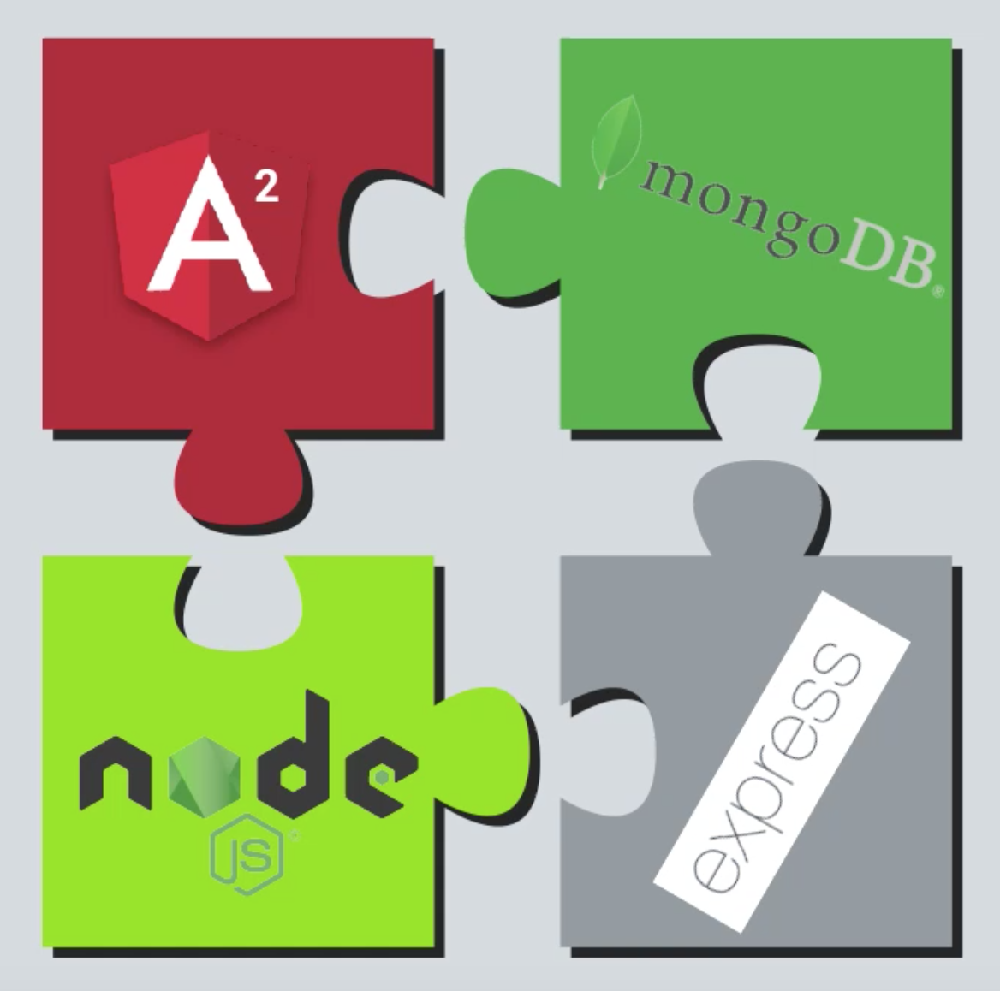

# Mean-Stack-Application

#### The Full Stack Javascript Framework.

<strong>MEAN2</strong> 
Visit this application:

https://mean-stack-deployment.herokuapp.com/

<strong>MEAN2</strong>  started out as a combination of

* [Node.js](https://nodejs.org/en/)
* [Angular5 web starter](https://github.com/AngularClass/angular-starter)
* [MongoDB](https://www.mongodb.com)
* [Express](https://expressjs.com/)

## Deployment

* [MLab for MOngoDB](https://mlab.com/home)
* [Heroku](https://www.heroku.com/)